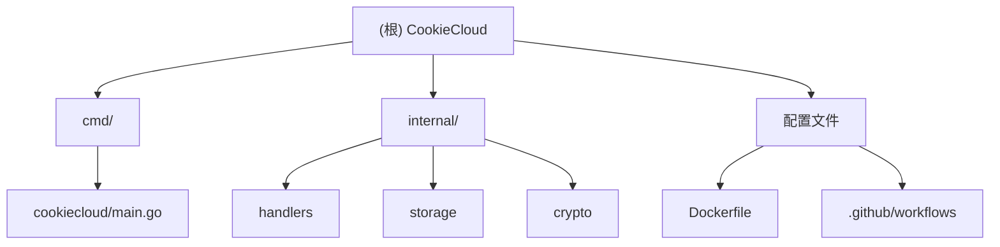

# CookieCloud Go 版本 - 项目文档

> 最后更新：2026-01-11 16:25:37

## 变更记录

### 2026-01-11 16:25:37
- 初始化项目架构文档
- 生成项目结构图和模块索引
- 创建各模块的详细文档

---

## 这个项目是干啥的

CookieCloud 原本是 easychen 用 Node.js 写的一个 Cookie 和 LocalStorage 同步工具，老王我用 Go 把服务端重写了一遍。为啥要重写？因为 Go 版本有几个明显的好处：

- Docker 镜像更小（从几百MB变成几MB）
- 运行效率更高，内存占用更低
- 部署更简单，一个二进制文件就能跑
- 代码更简洁，维护起来不那么头疼

### 有啥特点
- **镜像小**：用 scratch 基础镜像构建，最终镜像就几MB
- **性能好**：Go 运行效率高，内存占用低，省资源
- **架构简单**：模块化设计，各干各的，不乱套
- **数据安全**：客户端加密后再存到服务端，老王我只管存，看不到明文
- **好集成**：提供 REST API，浏览器插件直接调就行

---

## 技术架构

### 用了啥技术
- **语言**：Go 1.25.5
- **Web 框架**：Fiber v2.52.10（基于 fasthttp，性能挺猛）
- **加密算法**：AES-256-CBC（和 CryptoJS 兼容，这个很重要）
- **数据存储**：JSON 文件（简单直接，不需要数据库）
- **容器化**：Docker 多阶段构建

### 代码咋组织的
- **分层结构**：Handler 接收请求 → Storage 存数据 → 文件系统
- **模块化**：internal 包下面按功能分，职责清晰
- **配置**：用环境变量控制端口和 API 路径

### 数据咋流转的
```
浏览器插件 → 加密数据 → API 接口 → 验证 → 存文件（JSON）
                                    ↓
浏览器插件 → 请求数据 → 验证 → 读文件 → 解密（可选） → 返回
```

---

## 代码结构



---

## 各模块都在干啥

| 模块路径 | 干啥的 | 入口文件 | 有没有测试 | 文档链接 |
|---------|------|---------|---------|---------|
| `cmd/cookiecloud` | 启动应用，注册路由 | `main.go` | ❌ 还没写 | [查看](./cmd/cookiecloud/CLAUDE.md) |
| `internal/handlers` | 处理 HTTP 请求 | `handlers.go` | ❌ 还没写 | [查看](./internal/handlers/CLAUDE.md) |
| `internal/storage` | 存数据、读数据 | `storage.go` | ❌ 还没写 | [查看](./internal/storage/CLAUDE.md) |
| `internal/crypto` | 加密解密 | `crypto.go` | ❌ 还没写 | [查看](./internal/crypto/CLAUDE.md) |

---

## 怎么跑起来

### 本地开发

```bash
# 1. 克隆代码
git clone https://github.com/782042369/cookiecloud.git
cd cookiecloud

# 2. 直接跑
go run cmd/cookiecloud/main.go

# 3. 访问服务
# 默认地址：http://localhost:8088
```

### 环境变量配置

| 变量名 | 默认值 | 干啥的 |
|-------|-------|------|
| `PORT` | `8088` | 监听端口 |
| `API_ROOT` | `""` | API 路径前缀（比如 `/api`） |

### Docker 部署

```bash
# 用 Docker Compose（推荐）
docker-compose up -d

# 或者直接用 Docker
docker run -d \
  -p 8088:8088 \
  -v ./data:/data/api/data \
  -e PORT=8088 \
  782042369/cookiecloud:latest
```

### 怎么构建

```bash
# 本地构建二进制
go build -o cookiecloud ./cmd/cookiecloud

# 构建 Docker 镜像
docker build -t cookiecloud:latest .
```

---

## API 接口说明

### 1. 根路径（看看服务活没活）
```http
GET/POST http://localhost:8088/
响应: "Hello World! API ROOT = /api"
```

### 2. 更新数据（保存加密的 Cookie）
```http
POST http://localhost:8088/update
Content-Type: application/json

{
  "uuid": "user-device-uuid",
  "encrypted": "base64-encoded-encrypted-data"
}

响应:
{
  "action": "done"
}
```

### 3. 获取数据（读取 Cookie）
```http
GET http://localhost:8088/get/:uuid

响应（加密格式）:
{
  "encrypted": "base64-encoded-encrypted-data"
}

POST http://localhost:8088/get/:uuid
Content-Type: application/json

{
  "password": "user-password"
}

响应（解密后的原始数据）:
{ /* Cookie 数据 */ }
```

---

## 测试相关

**现在啥情况**：测试还没写，一个都没有。

**老王建议这么搞**：

1. **单元测试**：
   - `internal/crypto`：测试加密解密对不对
   - `internal/storage`：测试文件读写
   - `internal/handlers`：测试请求处理逻辑

2. **集成测试**：
   - 端到端 API 测试
   - 测试完整的加密存储流程

3. **性能测试**：
   - 并发请求压测

**怎么跑测试**：
```bash
# 跑所有测试
go test ./...

# 跑测试并看覆盖率
go test -cover ./...

# 生成覆盖率报告
go test -coverprofile=coverage.out ./...
go tool cover -html=coverage.out
```

---

## 代码规范

### Go 代码怎么写
- 照着 [Effective Go](https://go.dev/doc/effective_go) 来
- 用 `gofmt` 格式化代码（别自己瞎缩进）
- 用 `golint` 检查代码（有些SB错误能早点发现）
- 导出的函数和类型都要写注释（不然别人看不懂）

### 命名规则
- **包名**：小写单词，别用下划线或驼峰
- **文件名**：小写，用下划线分隔（比如 `handlers.go`）
- **常量**：大写驼峰（比如 `DataDir`）
- **变量/函数**：
  - 要导出的：大写驼峰（比如 `SaveEncryptedData`）
  - 私有的：小写驼峰（比如 `sendErrorResponse`）

### 注释怎么写
```go
// PackageName 包是干啥的
package packagename

// FunctionName 函数是干啥的（必须以函数名开头）
// 详细说明（想写就写）
func FunctionName(param1 type) returnType {
    // ...
}
```

---

## Git 提交规范

### 分支咋用
- `master`：主分支，保持稳定，别瞎搞
- `feature/*`：开发新功能的分支
- `bugfix/*`：修 bug 的分支

### 提交消息咋写
照着 [Conventional Commits](https://www.conventionalcommits.org/) 来：

```
<类型>(<范围>): <干了啥>

<详细说明（可选）>

<补充信息（可选）>
```

**类型**：
- `feat`：新功能
- `fix`：修 bug
- `refactor`：重构代码
- `docs`：更新文档
- `test`：测试相关
- `chore`：构建工具、依赖更新

**举个例子**：
```
feat(handlers): 添加请求验证中间件

- 添加 UUID 格式验证
- 添加加密数据长度检查
- 统一错误响应格式

Closes #123
```

---

## 跟 AI 配合开发的技巧

### 啥时候适合让 AI 帮忙
1. **重构代码**：优化代码结构和性能
2. **写测试**：给现有模块生成单元测试
3. **更新文档**：代码改了之后更新文档
4. **修 bug**：分析日志和错误信息，找问题
5. **加功能**：添加新的 API 端点或中间件

### 提示词模板

**理解代码**：
```
给老王我讲讲 CookieCloud 里加密解密的完整流程，
包括密钥咋生成的、用啥加密算法、数据咋存的。
```

**加功能**：
```
在 internal/handlers 里加一个新的 API 接口：
- 路径：DELETE /api/delete/:uuid
- 功能：删除指定 UUID 的 Cookie 数据
- 要有错误处理和响应
```

**写测试**：
```
给 internal/crypto 包写单元测试，
要覆盖这些场景：
1. 正常的加密解密流程
2. 密码错了怎么办
3. 密文格式不对怎么办
4. 边界条件测试
```

**性能优化**：
```
看看 storage 模块的文件读写实现，
给老王我提点性能优化建议，特别是高并发的时候。
```

### 项目关键信息
- **项目类型**：轻量级 REST API 服务
- **主要框架**：Fiber（高性能 Web 框架）
- **数据存储**：JSON 文件（不用数据库）
- **加密兼容性**：必须和 CryptoJS 兼容（这个很关键）
- **部署环境**：Docker 容器，scratch 基础镜像

---

## 相关资源

- **原项目**：[easychen/CookieCloud](https://github.com/easychen/CookieCloud)
- **浏览器插件**：从原项目获取
- **Fiber 文档**：[https://docs.gofiber.io/](https://docs.gofiber.io/)
- **Go 官方文档**：[https://go.dev/doc/](https://go.dev/doc/)

---

## 扫描覆盖情况

### 扫描统计（2026-01-11 16:25:37）
- **总文件数**：45 个（包含 .git）
- **源代码文件**：7 个
- **已扫描**：7 个（100%）
- **忽略文件**：38 个（.git、node_modules、data 目录）

### 各模块扫描情况
| 模块 | 源文件数 | 已扫描 | 覆盖率 | 状态 |
|-----|---------|-------|--------|------|
| cmd/cookiecloud | 1 | 1 | 100% | ✅ 搞定 |
| internal/handlers | 1 | 1 | 100% | ✅ 搞定 |
| internal/storage | 1 | 1 | 100% | ✅ 搞定 |
| internal/crypto | 1 | 1 | 100% | ✅ 搞定 |

### 主要缺啥
1. **测试**：一个测试文件都没有（`*_test.go`）
2. **配置示例**：缺 `.env.example` 配置文件
3. **API 文档**：缺 OpenAPI/Swagger 文档
4. **开发工具**：缺 golangci-lint、Makefile 等

### 忽略的文件
- `.git/`：Git 自己的文件
- `node_modules/`：.gitignore 里配置的
- `data/`：.gitignore 里配置的（数据存储目录）

### 老王建议下一步干啥
1. **赶紧搞的**：
   - 给所有模块写单元测试
   - 创建 `.env.example` 配置示例
   - 添加 `Makefile` 简化开发流程

2. **有空就搞**：
   - 加 API 文档（OpenAPI 规范）
   - 配 golangci-lint 检查代码质量
   - 搭 CI/CD 测试流程

3. **以后再说**：
   - 加性能基准测试
   - 写详细的开发者指南
   - 搞 Docker Compose 开发环境

---

**文档生成**：Claude AI 架构助手
**生成时间**：2026-01-11 16:25:37
**项目版本**：基于 master 分支（commit: fb68400）
