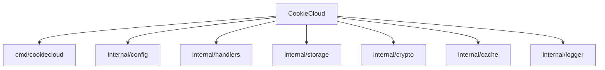

# CookieCloud Go 项目

> 最后更新：2026-01-28

## 项目快照

CookieCloud 的 Go 语言重写版本，提供轻量级 Cookie 和 LocalStorage 同步服务。

- **技术栈**：Go 1.25.5 + Fiber v2（Web 框架）
- **架构风格**：模块化设计，按功能领域组织（cmd/ + internal/）
- **核心特性**：
  - 兼容 CryptoJS 的 AES-256-CBC 加密
  - 内存缓存（5分钟 TTL）减少磁盘 I/O
  - 上下文取消支持（context.Context）
  - 速率限制（60次/分钟）防止 DDoS
  - 完善的单元测试与性能基准测试

## 模块导航



### 模块索引

| 模块 | 职责 | 关键文件/命令 | 文档 |
|------|------|--------------|------|
| **cmd/cookiecloud** | 应用入口，Web 服务器初始化 | `main.go` | @cmd/cookiecloud/CLAUDE.md |
| **internal/config** | 环境变量配置管理 | `config.go` | @internal/config/CLAUDE.md |
| **internal/handlers** | HTTP 路由与请求处理 | `handlers.go` | @internal/handlers/CLAUDE.md |
| **internal/storage** | JSON 文件存储（支持 context 取消） | `storage.go` | @internal/storage/CLAUDE.md |
| **internal/crypto** | AES-256-CBC 加密（CryptoJS 兼容） | `crypto.go` | @internal/crypto/CLAUDE.md |
| **internal/cache** | sync.Map 内存缓存（TTL 过期） | `cache.go` | @internal/cache/CLAUDE.md |
| **internal/logger** | 结构化日志（INFO/WARN/ERROR） | `logger.go` | @internal/logger/CLAUDE.md |

## 快速启动

### 本地开发

```bash
# 安装依赖
go mod download

# 运行服务
go run cmd/cookiecloud/main.go

# 运行测试
go test -v ./...

# 性能基准测试
go test -bench=. -benchmem ./...

# 代码质量检查
golangci-lint run
```

### Docker 部署

```bash
# 构建镜像
docker build -t cookiecloud:latest .

# 运行容器
docker run -d -p 8088:8088 -v ./data:/data cookiecloud:latest
```

参考：@README_cn.md

## 核心设计

### API 端点

- `GET/POST {API_ROOT}/` - 欢迎接口
- `POST {API_ROOT}/update` - 更新加密数据
- `GET/POST {API_ROOT}/get/:uuid` - 获取数据（POST 支持密码解密）

### 环境变量

| 变量 | 默认值 | 说明 |
|------|--------|------|
| `PORT` | `8088` | 服务端口 |
| `API_ROOT` | `` | API 路径前缀 |
| `DATA_DIR` | `./data` | 数据存储目录 |

### 加密兼容性

使用 OpenSSL 兼容的 `EVP_BytesToKey` 密钥派生，确保与原 Node.js 版本的加密数据互通。

## 质量工具

- **代码检查**：golangci-lint（配置：@.golangci.yml）
- **测试覆盖**：所有模块均有单元测试
- **性能测试**：handlers 包含基准测试
- **CI/CD**：GitHub Actions 自动构建 Docker 镜像

## 参考文档

- 项目说明：@README.md
- 中文文档：@README_cn.md
- Docker 配置：@Dockerfile
- CI 工作流：@.github/workflows/docker-image.yml
- 代码质量：@.golangci.yml

## 变更记录

### 2026-01-28
- 初始化 AI 上下文文档
- 生成模块导航结构
- 添加 Mermaid 结构图
