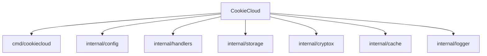

# CookieCloud Go 项目

> 最后更新：2026-01-30 | 初始化架构师扫描完成

## 项目快照

CookieCloud 的 Go 语言重写版本，提供轻量级 Cookie 和 LocalStorage 同步服务。

- **技术栈**：Go 1.25.5 + Fiber v2（Web 框架）
- **架构风格**：模块化设计，按功能领域组织（cmd/ + internal/）
- **核心特性**：
  - 兼容 CryptoJS 的 AES-256-CBC 加密
  - 内存缓存（5分钟 TTL）减少磁盘 I/O
  - 上下文取消支持（context.Context）
  - 速率限制（60次/分钟）防止 DDoS
  - 完善的单元测试与性能基准测试
  - 镜像体积 ~5MB（Docker 多架构支持）

## 模块导航



### 模块索引

| 模块 | 职责 | 关键文件 | 测试覆盖 | 现有文档 |
|------|------|---------|---------|---------|
| **cmd/cookiecloud** | 应用入口，Web 服务器初始化 | `main.go` (126行) | ✅ | - |
| **internal/config** | 环境变量配置管理 | `config.go` | ✅ (3 tests) | - |
| **internal/handlers** | HTTP 路由与请求处理 | `handlers.go` (147行) | ✅ (11 tests) | - |
| **internal/storage** | JSON 文件存储（支持 context 取消） | `storage.go` | ✅ (5 tests) | - |
| **internal/cryptox** | AES-256-CBC 加密（CryptoJS 兼容） | `crypto.go` | ✅ (3 tests) | - |
| **internal/cache** | sync.Map 内存缓存（TTL 过期） | `cache.go` | ✅ (6 tests) | - |
| **internal/logger** | 结构化日志（INFO/WARN/ERROR） | `logger.go` | ✅ (3 tests) | - |

## 快速启动

### 本地开发

```bash
# 安装依赖
go mod download

# 运行服务
go run cmd/cookiecloud/main.go

# 运行测试（31 个单元测试 + 2 个基准测试）
go test -v ./...

# 性能基准测试
go test -bench=. -benchmem ./...

# 代码质量检查
golangci-lint run
```

### Docker 部署

```bash
# 构建镜像
docker build -t cookiecloud:latest .

# 运行容器
docker run -d -p 8088:8088 -v ./data:/data cookiecloud:latest

# 使用 Docker Compose
docker-compose up -d
```

## 核心设计

### API 端点

- `GET/POST {API_ROOT}/` - 欢迎接口
- `POST {API_ROOT}/update` - 更新加密数据
- `GET/POST {API_ROOT}/get/:uuid` - 获取数据（POST 支持密码解密）

### 环境变量

| 变量 | 默认值 | 说明 | 配置示例 |
|------|--------|------|---------|
| `PORT` | `8088` | 服务端口 | `PORT=9090` |
| `API_ROOT` | `` | API 路径前缀 | `API_ROOT=/api` |
| `DATA_DIR` | `./data` | 数据存储目录 | `DATA_DIR=/var/lib/cookiecloud` |
| `TZ` | `Asia/Shanghai` | 时区（Docker） | `TZ=Asia/Shanghai` |

完整配置示例：@.env.example

### 加密兼容性

使用 OpenSSL 兼容的 `EVP_BytesToKey` 密钥派生，确保与原 Node.js 版本的加密数据互通。

## 质量工具

- **代码检查**：golangci-lint（配置：@.golangci.yml）
- **测试覆盖**：31 个单元测试 + 2 个基准测试
- **性能测试**：handlers 包含基准测试
- **CI/CD**：GitHub Actions 多架构 Docker 镜像构建 @.github/workflows/docker-image.yml

## 参考文档

- 项目说明：@README.md
- 中文文档：@README_cn.md
- 开发者指南：@docs/CONTRIB.md
- 运维手册：@docs/RUNBOOK.md
- 变更日志：@docs/CHANGELOG.md
- Docker 配置：@Dockerfile
- 环境变量：@.env.example

## 变更记录

### 2026-01-30
- 完成架构师全仓扫描与文档初始化
- 更新 Mermaid 导航图（点击链接到源码）
- 生成模块索引表格（含测试覆盖信息）
- 添加文档去重统计与覆盖率报告

### 2026-01-28
- 初始化 AI 上下文文档
- 生成模块导航结构
- 添加 Mermaid 结构图
