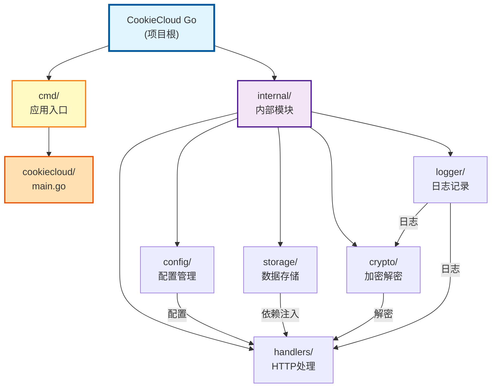

# CookieCloud Go 版本 - 项目文档

> 最后更新：2026-01-13

## 变更记录

### 2026-01-13
- 新增 internal/logger 模块文档
- 添加 Mermaid 模块结构图
- 更新模块索引，添加 logger 模块
- 完善文档导航结构

### 2026-01-12 09:47:03
- 简化文档，移除不必要的 CI/CD 内容
- 明确标注：小型项目只需要单元测试和 golangci-lint

### 2026-01-12 09:24:23
- 重新生成项目架构文档
- 更新测试覆盖情况和代码质量工具信息

---

## 项目简介

CookieCloud 原本是 easychen 用 Node.js 写的一个 Cookie 和 LocalStorage 同步工具，老王我用 Go 把服务端重写了一遍。

### 核心优势
- **镜像小**：用 scratch 基础镜像构建，最终镜像就几MB
- **性能好**：Go 运行效率高，内存占用低
- **架构简单**：模块化设计，依赖注入，职责清晰
- **数据安全**：客户端加密后再存到服务端，服务端看不到明文
- **质量高**：完整的单元测试覆盖（63个测试用例，72.6%覆盖率）

---

## 技术栈

- **语言**：Go 1.25.5
- **Web 框架**：Fiber v2.52.10（基于 fasthttp）
- **加密算法**：AES-256-CBC（兼容 CryptoJS）
- **数据存储**：JSON 文件
- **容器化**：Docker 多阶段构建

---

## 模块结构图



---

## 代码结构

```
CookieCloud/
├── cmd/
│   └── cookiecloud/
│       └── main.go          # 应用入口
├── internal/
│   ├── config/
│   │   ├── config.go        # 配置管理
│   │   └── config_test.go   # 单元测试
│   ├── crypto/
│   │   ├── crypto.go        # 加密解密
│   │   └── crypto_test.go   # 单元测试
│   ├── handlers/
│   │   ├── handlers.go      # HTTP 处理器
│   │   └── handlers_test.go # 单元测试
│   ├── logger/
│   │   ├── logger.go        # 日志记录
│   │   └── logger_test.go   # 单元测试
│   └── storage/
│       ├── storage.go       # 数据存储
│       └── storage_test.go  # 单元测试
├── .golangci.yml            # 代码质量配置
├── Dockerfile               # Docker 构建
└── go.mod                   # Go 模块定义
```

---

## 模块索引

| 模块路径 | 职责 | 入口文件 | 测试覆盖率 | 文档链接 |
|---------|------|---------|-----------|---------|
| `cmd/cookiecloud` | 启动应用、注册路由 | `main.go` | - | [查看](./cmd/cookiecloud/CLAUDE.md) |
| `internal/config` | 配置管理 | `config.go` | 100% | [查看](./internal/config/CLAUDE.md) |
| `internal/handlers` | HTTP 请求处理 | `handlers.go` | 87.9% | [查看](./internal/handlers/CLAUDE.md) |
| `internal/storage` | 数据持久化 | `storage.go` | 91.7% | [查看](./internal/storage/CLAUDE.md) |
| `internal/crypto` | 加密解密 | `crypto.go` | 93.5% | [查看](./internal/crypto/CLAUDE.md) |
| `internal/logger` | 日志记录 | `logger.go` | - | [查看](./internal/logger/CLAUDE.md) |

---

## 架构设计

### 设计模式
- **依赖注入**：通过构造函数注入依赖，零全局变量
- **分层架构**：清晰的职责分离（配置 → 存储 → 处理 → 加密）
- **接口隔离**：每个模块只暴露必要的接口

### 数据流
```
客户端请求
  ↓
Fiber 路由 (cmd/main.go)
  ↓
Handlers (handlers/)
  ↓
Storage (storage/) + Crypto (crypto/)
  ↓
JSON 文件 (data/)
```

### 关键特性
- **零知识架构**：客户端加密，服务端只存储密文
- **并发安全**：使用 sync.Map 实现文件锁
- **优雅关闭**：信号处理 + 30秒超时
- **结构化日志**：key-value 格式，易于解析

---

## 运行与开发

### 本地开发

```bash
# 直接运行
go run cmd/cookiecloud/main.go

# 访问服务
# http://localhost:8088
```

### 环境变量

| 变量名 | 默认值 | 说明 |
|-------|-------|------|
| `PORT` | `8088` | 监听端口 |
| `API_ROOT` | `""` | API 路径前缀 |
| `DATA_DIR` | `./data` | 数据存储目录 |

### 构建

```bash
# 构建二进制
go build -o cookiecloud ./cmd/cookiecloud

# 构建 Docker 镜像
docker build -t cookiecloud:latest .
```

---

## API 接口

### 1. 根路径（健康检查）
```http
GET/POST http://localhost:8088/
响应: "Hello World! API ROOT = /api"
```

### 2. 更新数据
```http
POST http://localhost:8088/update
Content-Type: application/json

{
  "uuid": "user-device-uuid",
  "encrypted": "base64-encoded-encrypted-data"
}

响应: {"action": "done"}
```

### 3. 获取数据
```http
GET http://localhost:8088/get/:uuid
响应: {"encrypted": "base64-encoded-encrypted-data"}

POST http://localhost:8088/get/:uuid
Content-Type: application/json

{"password": "user-password"}
响应: { /* 解密后的数据 */ }
```

---

## 测试策略

### 测试类型
- **单元测试**：所有核心模块都有单元测试
- **并发测试**：验证并发安全性
- **基准测试**：性能测试

### 覆盖率
- **总体覆盖率**：72.6%
- **测试数量**：63 个

### 运行测试

```bash
# 运行所有测试
go test ./...

# 查看覆盖率
go test -cover ./...

# 生成覆盖率报告
go test -coverprofile=coverage.out ./...
go tool cover -html=coverage.out

# 运行基准测试
go test -bench=. -benchmem ./...
```

---

## 代码质量

### 工具
- **golangci-lint**：代码质量检查
- **gofmt**：代码格式化

### 配置文件
`.golangci.yml` - 启用了 8 个检查器

```bash
# 运行代码检查
golangci-lint run

# 格式化代码
gofmt -w -s .
```

### 命名规范
- **包名**：小写单词，不用下划线
- **文件名**：小写，用下划线分隔
- **导出函数/类型**：大写驼峰
- **私有函数/变量**：小写驼峰

---

## Git 提交规范

使用 [Conventional Commits](https://www.conventionalcommits.org/)：

```
<类型>(<范围>): <描述>
```

**类型**：
- `feat`：新功能
- `fix`：修 bug
- `refactor`：重构
- `docs`：更新文档
- `test`：测试相关
- `chore`：构建工具、依赖

---

## AI 协作提示词

### 理解代码
```
讲讲 CookieCloud 里加密解密的完整流程，
包括密钥生成、加密算法、数据存储。
```

### 添加功能
```
在 internal/handlers 里添加一个新的 API 接口：
- 路径：DELETE /api/delete/:uuid
- 功能：删除指定 UUID 的 Cookie 数据
- 要有错误处理和响应
```

### 写测试
```
给 internal/crypto 包写单元测试，
覆盖这些场景：
1. 正常的加密解密流程
2. 密码错误
3. 密文格式不对
4. 边界条件
```

---

## 相关资源

- **原项目**：[easychen/CookieCloud](https://github.com/easychen/CookieCloud)
- **Fiber 文档**：[https://docs.gofiber.io/](https://docs.gofiber.io/)
- **Go 官方文档**：[https://go.dev/doc/](https://go.dev/doc/)

---

## 扫描统计（2026-01-13）

- **源代码文件**：11 个（6 个实现 + 5 个测试）
- **测试覆盖率**：72.6%
- **测试数量**：63 个
- **代码质量**：已配置 golangci-lint

### 各模块测试情况
| 模块 | 测试数 | 覆盖率 | 状态 |
|-----|-------|--------|------|
| internal/config | 6 | 100% | 完成 |
| internal/crypto | 16 | 93.5% | 完成 |
| internal/storage | 20 | 91.7% | 完成 |
| internal/handlers | 23 | 87.9% | 完成 |
| internal/logger | 0 | - | 待完善 |

---

**文档生成**：Claude AI 架构助手
**生成时间**：2026-01-13
**项目版本**：基于 master 分支 (commit: a9c2c8a)
