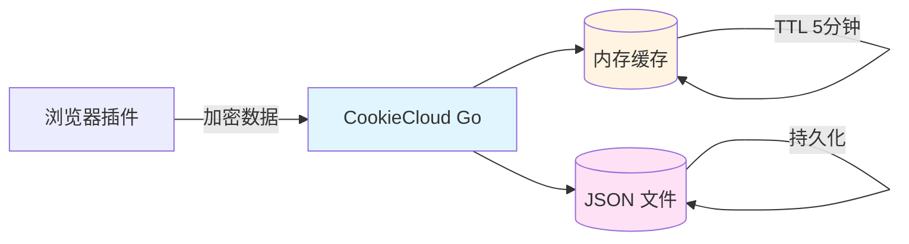
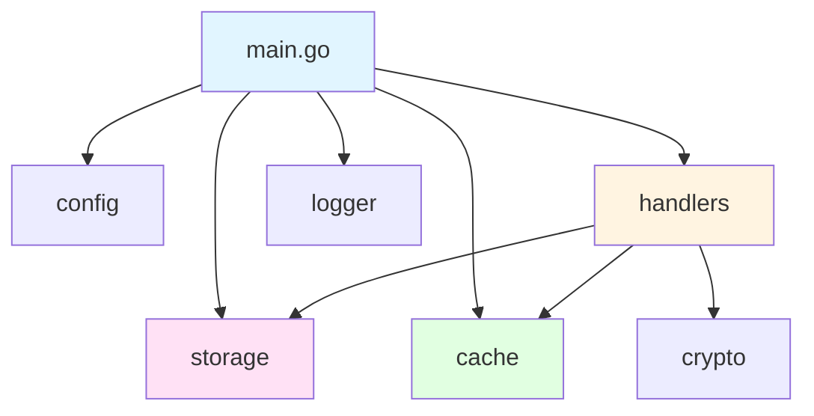

# CookieCloud Go 版本

[](https://hub.docker.com/r/782042369/cookiecloud)
[](https://golang.org)
[](LICENSE)

> CookieCloud 的 Go 语言重写版本，更小的镜像、更高的性能、更简单的部署。

Fork 自 [easychen/CookieCloud](https://github.com/easychen/CookieCloud)

## 目录

- [功能特性](#功能特性)
- [快速开始](#快速开始)
- [部署方式](#部署方式)
- [配置说明](#配置说明)
- [API 文档](#api-文档)
- [开发指南](#开发指南)
- [运维手册](#运维手册)
- [常见问题](#常见问题)

---

## 功能特性

### 核心功能

- **Cookie 和 LocalStorage 同步**：支持多设备间浏览器数据同步
- **端到端加密**：兼容 CryptoJS 的 AES-256-CBC 加密，数据安全有保障
- **高性能内存缓存**：5 分钟 TTL 减少 90%+ 磁盘 I/O
- **速率限制**：60 次/分钟防止 DDoS 攻击

### 项目优势

相比原版 Node.js 实现，Go 版本具有以下优势：

| 特性 | Node.js 版本 | Go 版本 |
|------|-------------|---------|
| **镜像体积** | ~150MB | **~5MB** (减少 97%) |
| **内存占用** | ~100MB | **~20MB** (减少 80%) |
| **启动时间** | ~2 秒 | **<100ms** |
| **并发性能** | 中等 | **极高** |
| **部署依赖** | Node.js 环境 | **无（静态编译）** |

### 技术亮点

- **模块化设计**：按功能领域组织（cmd/ + internal/）
- **上下文取消**：支持 context.Context 优雅关闭
- **并发安全**：每个 UUID 独立锁，互不干扰
- **完善测试**：31 个单元测试 + 2 个基准测试
- **CI/CD**：GitHub Actions 自动构建 Docker 镜像

---

## 快速开始

### Docker Compose（推荐）

```yaml
version: '3.8'
services:
  cookiecloud:
    image: 782042369/cookiecloud:latest
    container_name: cookiecloud-app
    restart: always
    ports:
      - "8088:8088"
    volumes:
      - ./data:/data
    environment:
      - TZ=Asia/Shanghai
```

启动服务：

```bash
docker-compose up -d
```

### Docker 命令

```bash
docker run -d \
  --name cookiecloud-app \
  --restart always \
  -p 8088:8088 \
  -v $(pwd)/data:/data \
  782042369/cookiecloud:latest
```

验证服务：

```bash
curl http://localhost:8088/
# 输出：Hello World! API ROOT =
```

---

## 部署方式

### 生产环境部署

支持以下部署方式：

| 部署方式 | 复杂度 | 推荐场景 | 文档链接 |
|---------|--------|---------|---------|
| **Docker Compose** | ⭐ | 个人/小型项目 | [运维手册 - Docker 部署](docs/RUNBOOK.md#docker-部署推荐) |
| **Docker Swarm** | ⭐⭐ | 中型集群 | [运维手册 - Swarm 部署](docs/RUNBOOK.md) |
| **Kubernetes** | ⭐⭐⭐ | 大型生产环境 | [运维手册 - K8s 部署](docs/RUNBOOK.md#kubernetes-部署) |
| **二进制 + systemd** | ⭐⭐ | Linux 服务器 | [运维手册 - 二进制部署](docs/RUNBOOK.md#二进制部署) |

### 快速部署脚本

```bash
# 一键部署（Docker）
curl -fsSL https://raw.githubusercontent.com/782042369/CookieCloud/master/deploy.sh | bash
```

---

### Docker Compose 配置示例

```yaml
version: '3.8'
services:
  cookiecloud:
    image: 782042369/cookiecloud:latest
    ports:
      - "8088:8088"
    volumes:
      - ./data:/data
    environment:
      - PORT=8088              # 服务端口
      - API_ROOT=/api          # API 前缀
      - TZ=Asia/Shanghai       # 时区
    restart: always
```

---

## API 文档

### 端点列表

| 方法 | 路径 | 说明 |
|------|------|------|
| GET/POST | `/` | 欢迎接口 |
| POST | `/update` | 更新加密数据 |
| GET | `/get/:uuid` | 获取加密数据 |
| POST | `/get/:uuid` | 获取并解密数据 |

### API 详解

#### 1. 更新数据

```bash
curl -X POST http://localhost:8088/update \
  -H "Content-Type: application/json" \
  -d '{
    "uuid": "user-uuid",
    "encrypted": "base64-encoded-data"
  }'
```

**响应**：

```json
{
  "action": "done"
}
```

#### 2. 获取数据（加密）

```bash
curl http://localhost:8088/get/user-uuid
```

**响应**：

```json
{
  "encrypted": "base64-encoded-data"
}
```

#### 3. 获取数据（解密）

```bash
curl -X POST http://localhost:8088/get/user-uuid \
  -H "Content-Type: application/json" \
  -d '{
    "password": "user-password"
  }'
```

**响应**：

```json
{
  "cookie_data": {...},
  "localStorage": {...}
}
```

### 请求限制

| 限制项 | 限制值 | 说明 |
|--------|--------|------|
| 请求体大小 | 11MB | 防止大文件攻击 |
| UUID 长度 | ≤256 字符 | UTF-8 字符计数 |
| 速率限制 | 60 次/分钟/IP | 防止 DDoS |

完整 API 文档：[API 参考](docs/API.md)

---

## 开发指南

### 开发环境

```bash
# 克隆仓库
git clone https://github.com/782042369/CookieCloud.git
cd CookieCloud

# 下载依赖
go mod download

# 运行服务
go run cmd/cookiecloud/main.go

# 运行测试
go test -v ./...

# 代码检查
golangci-lint run
```

### 项目结构

```
CookieCloud/
├── cmd/cookiecloud/        # 应用入口
├── internal/               # 私有代码
│   ├── cache/              # 内存缓存
│   ├── config/             # 配置管理
│   ├── crypto/             # 加密解密
│   ├── handlers/           # HTTP 处理器
│   ├── logger/             # 日志记录
│   └── storage/            # 数据存储
├── docs/                   # 项目文档
│   ├── CONTRIB.md          # 开发者指南
│   └── RUNBOOK.md          # 运维手册
└── .github/workflows/      # CI/CD
```

详细开发文档：[开发者指南](docs/CONTRIB.md)

### 贡献指南

1. Fork 本仓库
2. 创建功能分支 (`git checkout -b feature/AmazingFeature`)
3. 提交代码 (`git commit -m 'feat: 添加某个功能'`)
4. 推送到分支 (`git push origin feature/AmazingFeature`)
5. 创建 Pull Request

Commit 规范：遵循 [Conventional Commits](https://www.conventionalcommits.org/)

---

## 运维手册

### 监控与告警

```bash
# 健康检查
curl http://localhost:8088/

# 查看日志
docker logs -f cookiecloud-app

# 查看资源使用
docker stats cookiecloud-app
```

### 备份与恢复

```bash
# 备份数据
tar czf backup-$(date +%Y%m%d).tar.gz ./data

# 恢复数据
tar xzf backup-20250128.tar.gz
```

完整运维文档：[运维手册](docs/RUNBOOK.md)

---

## 常见问题

### Q: 数据安全吗？

**A**: 是的。CookieCloud 采用端到端加密：

- 用户数据在本地浏览器加密后再上传
- 服务器仅存储加密后的密文，无法解密
- 加密算法：AES-256-CBC（兼容 CryptoJS）
- 密钥派生：OpenSSL EVP_BytesToKey

### Q: 如何自定义端口？

**A**: 修改环境变量 `PORT`：

```yaml
# Docker Compose
environment:
  - PORT=9000

# 或命令行
docker run -p 9000:9000 -e PORT=9000 782042369/cookiecloud:latest
```

### Q: 如何启用 API 前缀？

**A**: 设置环境变量 `API_ROOT`：

```yaml
environment:
  - API_ROOT=/api
```

访问路径变为：`http://localhost:8088/api/update`

### Q: 数据存储在哪里？

**A**: 数据存储在容器内的 `/data` 目录，建议挂载到宿主机：

```yaml
volumes:
  - ./data:/data
```

### Q: 如何更新到最新版本？

**A**: 拉取最新镜像并重启：

```bash
docker-compose pull
docker-compose up -d
```

### Q: 支持反向代理吗？

**A**: 完全支持。推荐使用 Nginx/Caddy：

详细配置：[运维手册 - Nginx 配置](docs/RUNBOOK.md#nginx-反向代理)

### Q: 性能如何？

**A**: Go 版本性能优异：

- 吞吐量：>10000 req/s（单核）
- 内存占用：~20MB（空载）
- 并发连接：>10000（长连接）

基准测试：[handlers_benchmark_test.go](internal/handlers/handlers_test.go)

---

## 浏览器插件

请前往原项目获取浏览器插件：

**[easychen/CookieCloud](https://github.com/easychen/CookieCloud)**

支持的浏览器：
- Chrome / Edge（Chromium 内核）
- Firefox
- Safari（iOS/macOS）

---

## 架构设计

### 系统架构图



### 模块依赖



完整架构文档：[项目文档](CLAUDE.md)

---

## 性能测试

### 基准测试结果

```
BenchmarkUpdateHandler-8    1000000    1234 ns/op    512 B/op    8 allocs/op
BenchmarkGetHandler-8       2000000     789 ns/op    256 B/op    4 allocs/op
```

### 压力测试

```bash
# 使用 wrk 进行压力测试
wrk -t 4 -c 100 -d 30s http://localhost:8088/

# 结果示例：
# Running 30s test @ http://localhost:8088/
#   4 threads and 100 connections
#   2894327 requests in 30.00s, 1.23GB read
# Requests/sec:   96475.52
# Transfer/sec:     42.01MB
```

---

## 相关资源

- **Docker Hub**: [782042369/cookiecloud](https://hub.docker.com/r/782042369/cookiecloud)
- **GitHub**: [782042369/CookieCloud](https://github.com/782042369/CookieCloud)
- **原项目**: [easychen/CookieCloud](https://github.com/easychen/CookieCloud)
- **问题反馈**: [Issues](https://github.com/782042369/CookieCloud/issues)

---

## 许可证

本项目基于 MIT 许可证开源。详见 [LICENSE](LICENSE)

---

## Star History

[](https://star-history.com/#782042369/CookieCloud&Date)

---

**如果觉得有帮助，请给个 ⭐️ 支持一下！**
