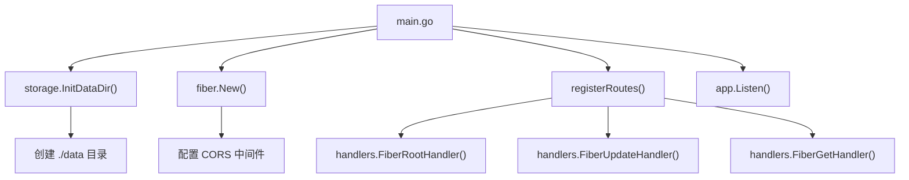

# 入口模块 (cmd/cookiecloud)

[根目录](../../CLAUDE.md) > [cmd](../) > **cookiecloud**

> 最后更新：2026-01-11 16:25:37

## 变更记录

### 2026-01-11 16:25:37
- 初始化模块文档

---

## 这个模块干啥的

这是 CookieCloud 应用的入口，主要干这几件事：

1. **初始化应用**：创建数据目录，准备好存储环境
2. **创建 Web 应用**：用 Fiber 框架创建一个 Web 应用实例
3. **注册路由**：配置 API 路由和中间件
4. **启动服务**：启动 HTTP 服务器监听端口
5. **读取配置**：从环境变量读取配置参数

---

## 入口与启动

### 主入口文件
- **文件路径**：`cmd/cookiecloud/main.go`
- **包名**：`main`
- **启动函数**：`main()`

### 启动流程
```
main()
  ↓
1. storage.InitDataDir() - 创建数据目录
  ↓
2. fiber.New() - 创建 Fiber 应用
  ↓
3. app.Use(cors.New()) - 加 CORS 中间件
  ↓
4. registerRoutes() - 注册路由
  ↓
5. app.Listen() - 启动服务器
```

### 怎么启动
```bash
# 直接跑
go run cmd/cookiecloud/main.go

# 编译后跑
go build -o cookiecloud ./cmd/cookiecloud
./cookiecloud

# 带环境变量跑
PORT=9000 API_ROOT=/api go run cmd/cookiecloud/main.go
```

---

## 对外接口

### 路由配置

| 方法 | 路径 | 处理器 | 干啥的 |
|-----|------|--------|------|
| GET/POST | `{API_ROOT}/` | `handlers.FiberRootHandler` | 健康检查/欢迎信息 |
| POST | `{API_ROOT}/update` | `handlers.FiberUpdateHandler` | 保存加密数据 |
| GET/POST | `{API_ROOT}/get/:uuid` | `handlers.FiberGetHandler` | 获取数据（可解密） |

**注意**：`{API_ROOT}` 由环境变量 `API_ROOT` 控制，默认为空字符串。

### 环境变量配置

| 变量名 | 类型 | 默认值 | 干啥的 |
|-------|------|-------|------|
| `PORT` | string | `8088` | 监听端口 |
| `API_ROOT` | string | `""` | API 路径前缀（自动去掉尾部斜杠） |

### 示例
```bash
# 默认配置
PORT=8088, API_ROOT=""
访问路径：http://localhost:8088/update

# 自定义配置
PORT=9000, API_ROOT=/api
访问路径：http://localhost:9000/api/update
```

---

## 依赖和配置

### 内部依赖
```
cmd/cookiecloud
├── internal/handlers  # HTTP 请求处理器
└── internal/storage   # 数据存储初始化
```

### 外部依赖
```go
require (
    github.com/gofiber/fiber/v2 v2.52.10           // Web 框架
    github.com/gofiber/fiber/v2/middleware/cors   // CORS 中间件
)
```

### 配置文件
- 不需要配置文件
- 所有配置都用环境变量
- 数据目录：`./data`（在 storage 模块里定义）

---

## 数据模型

这个模块不定义数据模型，所有数据结构都在 `internal/handlers` 包里：

- `UpdateRequest`：更新请求的数据结构
- `DecryptRequest`：解密请求的数据结构

详见：[handlers 模块文档](../../internal/handlers/CLAUDE.md)

---

## 测试相关

### 现在啥情况
- ❌ 没有测试文件

### 老王建议这么测
1. **启动测试**：
   - 测试应用能不能正常启动
   - 测试环境变量解析对不对
   - 测试数据目录初始化

2. **路由测试**：
   - 测试所有路由注册了没有
   - 测试 API_ROOT 前缀对不对
   - 测试 CORS 中间件生效没

3. **集成测试**：
   - 测试完整的请求-响应流程
   - 测试并发请求处理

### 测试示例
```go
func TestMain(t *testing.T) {
    // 测试应用启动
    go main()
    time.Sleep(1 * time.Second)

    // 测试健康检查
    resp, err := http.Get("http://localhost:8088/")
    assert.NoError(t, err)
    assert.Equal(t, 200, resp.StatusCode)
}
```

---

## 代码结构

### 文件组织
```
cmd/cookiecloud/
└── main.go           # 应用入口和路由注册
```

### 函数列表

| 函数名 | 类型 | 干啥的 |
|-------|------|------|
| `main()` | void | 应用主入口 |
| `registerRoutes()` | void | 注册所有 API 路由 |
| `getPort()` | string | 获取端口号（从环境变量或默认值） |

---

## 常见问题

### Q1: 怎么改默认端口？
**A**: 设置环境变量 `PORT`：
```bash
export PORT=9000
go run cmd/cookiecloud/main.go
```

### Q2: 怎么用自定义 API 路径前缀？
**A**: 设置环境变量 `API_ROOT`：
```bash
export API_ROOT=/api/v1
go run cmd/cookiecloud/main.go
# 访问：http://localhost:8088/api/v1/update
```

### Q3: 数据目录在哪创建？
**A**: 应用启动时自动在 `./data` 路径创建（相对工作目录），由 `storage.InitDataDir()` 函数负责。

### Q4: 怎么优雅关闭服务器？
**A**: 当前版本没有实现优雅关闭，建议手动加信号处理：
```go
// 监听 SIGINT 和 SIGTERM 信号
c := make(chan os.Signal, 1)
signal.Notify(c, os.Interrupt, syscall.SIGTERM)
go func() {
    <-c
    fmt.Println("正在关闭服务器...")
    app.Shutdown()
}()
```

---

## 相关文件清单

### 源代码文件
- `cmd/cookiecloud/main.go` - 应用主入口

### 配置文件
- `Dockerfile` - Docker 构建配置
- `.github/workflows/docker-image.yml` - CI/CD 配置

### 文档文件
- `README.md` - 项目说明（英文）
- `README_cn.md` - 项目说明（中文）
- `CLAUDE.md` - 项目文档（根目录）

---

## 依赖关系图



---

**模块维护者**：782042369
**最后审核**：2026-01-11
**文档版本**：1.0.0
