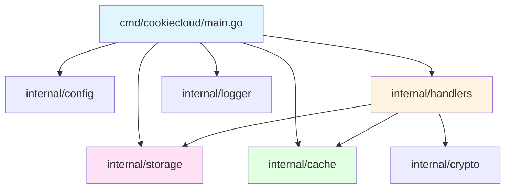

# CookieCloud - 开发者指南

> 最后更新：2026-01-28

本文档面向 CookieCloud Go 版本的开发者，介绍开发环境搭建、代码规范、测试流程等核心内容。

## 目录

- [开发环境](#开发环境)
- [项目结构](#项目结构)
- [开发工作流](#开发工作流)
- [测试指南](#测试指南)
- [代码质量](#代码质量)
- [性能优化](#性能优化)

---

## 开发环境

### 系统要求

- **Go 版本**：1.25.5+
- **操作系统**：Linux / macOS / Windows
- **磁盘空间**：至少 100MB（含依赖）
- **内存**：建议 2GB+

### 工具安装

```bash
# 安装 Go 1.25.5
# macOS
brew install go

# Ubuntu/Debian
sudo apt install golang-go

# 验证安装
go version
```

### 项目初始化

```bash
# 克隆仓库
git clone https://github.com/782042369/CookieCloud.git
cd CookieCloud

# 下载依赖
go mod download

# 验证依赖
go mod verify

# 运行服务（开发模式）
go run cmd/cookiecloud/main.go
```

### 环境变量

创建 `.env` 文件（可选，用于本地开发）：

```bash
# .env 示例
PORT=8088              # HTTP 服务端口（默认 8088）
API_ROOT=/api          # API 路径前缀（默认 /）
DATA_DIR=./data        # 数据存储目录（默认 ./data）
```

**注意**：Go 不自动加载 `.env` 文件，如需使用请参考 `godotenv` 库（本项目未集成）。

---

## 项目结构

```
CookieCloud/
├── cmd/
│   └── cookiecloud/        # 应用入口
│       ├── main.go         # 主函数（115 行）
│       └── CLAUDE.md       # 模块文档
│
├── internal/               # 私有代码（不可被外部导入）
│   ├── cache/              # 内存缓存（sync.Map + TTL）
│   ├── config/             # 环境变量配置
│   ├── crypto/             # AES-256-CBC 加密
│   ├── handlers/           # HTTP 路由处理器
│   ├── logger/             # 结构化日志
│   └── storage/            # JSON 文件存储
│
├── .github/
│   └── workflows/
│       └── docker-image.yml # CI/CD 配置
│
├── docs/                   # 项目文档
│   ├── CONTRIB.md          # 开发者指南（本文档）
│   └── RUNBOOK.md          # 运维手册
│
├── Dockerfile              # Docker 构建文件
├── go.mod                  # Go 模块定义
├── go.sum                  # 依赖锁定文件
├── .golangci.yml           # 代码检查配置
├── README.md               # 项目说明
└── README_cn.md            # 中文说明
```

### 模块依赖关系



---

## 开发工作流

### Git 分支策略

```bash
# 1. 创建功能分支
git checkout -b feature/your-feature-name

# 2. 提交代码（遵循 Conventional Commits）
git add .
git commit -m "feat(handlers): 添加速率限制中间件"

# 3. 推送到远程
git push -u origin feature/your-feature-name

# 4. 创建 Pull Request
# GitHub 上创建 PR，等待 Code Review
```

### Commit 规范

遵循 [Conventional Commits](https://www.conventionalcommits.org/)：

| Type | 说明 | 示例 |
|------|------|------|
| `feat` | 新功能 | `feat(cache): 添加缓存过期清理功能` |
| `fix` | Bug 修复 | `fix(storage): 修复并发写入竞态条件` |
| `refactor` | 重构 | `refactor(crypto): 优化密钥派生性能` |
| `docs` | 文档 | `docs: 更新 API 使用示例` |
| `test` | 测试 | `test(handlers): 添加边界条件测试` |
| `chore` | 构建/工具 | `chore: 升级 golangci-lint 版本` |
| `perf` | 性能优化 | `perf(cache): 减少锁竞争` |
| `ci` | CI/CD | `ci: 添加 GitHub Actions 工作流` |

### 本地开发命令

```bash
# 运行服务（热重载需要安装 air）
go run cmd/cookiecloud/main.go

# 运行测试（详细输出）
go test -v ./...

# 运行特定模块测试
go test -v ./internal/handlers

# 运行基准测试
go test -bench=. -benchmem ./...

# 代码质量检查
golangci-lint run

# 代码格式化
go fmt ./...

# 静态分析
go vet ./...
```

---

## 测试指南

### 测试覆盖

当前测试覆盖情况：

| 模块 | 测试文件 | 测试数量 | 基准测试 |
|------|---------|---------|---------|
| `internal/cache` | cache_test.go | 6 | ❌ |
| `internal/config` | config_test.go | 3 | ❌ |
| `internal/crypto` | crypto_test.go | 3 | ❌ |
| `internal/handlers` | handlers_test.go | 11 | ✅ (2) |
| `internal/logger` | logger_test.go | 3 | ❌ |
| `internal/storage` | storage_test.go | 5 | ❌ |

**总计**：31 个单元测试 + 2 个基准测试

### 运行测试

```bash
# 运行所有测试
go test -v ./...

# 生成覆盖率报告
go test -coverprofile=coverage.out ./...
go tool cover -html=coverage.out -o coverage.html

# 运行特定测试
go test -v -run TestCacheSet ./internal/cache

# 运行基准测试
go test -bench=. -benchmem ./internal/handlers
```

### 编写测试

遵循 **Table-Driven Tests** 模式：

```go
func TestCacheGet(t *testing.T) {
    tests := []struct {
        name    string
        uuid    string
        setup   func(*cache.Cache)
        want    string
        found   bool
    }{
        {
            name: "缓存命中",
            uuid: "test-uuid",
            setup: func(c *cache.Cache) {
                c.Set("test-uuid", "encrypted-data")
            },
            want:  "encrypted-data",
            found: true,
        },
        {
            name:  "缓存未命中",
            uuid:  "non-existent",
            setup: func(c *cache.Cache) {},
            want:  "",
            found: false,
        },
    }

    for _, tt := range tests {
        t.Run(tt.name, func(t *testing.T) {
            c := cache.New(5 * time.Minute)
            tt.setup(c)

            got, found := c.Get(tt.uuid)
            if found != tt.found || got != tt.want {
                t.Errorf("Get() = (%v, %v), want (%v, %v)",
                    got, found, tt.want, tt.found)
            }
        })
    }
}
```

---

## 代码质量

### Linting

项目使用 `golangci-lint` 进行代码检查：

```bash
# 安装 golangci-lint
# macOS
brew install golangci-lint

# Linux
curl -sSfL https://raw.githubusercontent.com/golangci/golangci-lint/master/install.sh | sh -s -- -b $(go env GOPATH)/bin

# 运行检查
golangci-lint run

# 自动修复
golangci-lint run --fix
```

### 配置文件

.golangci.yml 已启用以下检查：

- **gofmt**：代码格式化检查
- **govet**：静态分析（shadow、nilfunc 等）
- **errcheck**：错误处理检查
- **staticcheck**：Bug 检测和代码简化
- **gosimple**：代码简化建议
- **unused**：未使用代码检测

### 代码审查清单

提交代码前确保：

- [ ] 所有测试通过（`go test ./...`）
- [ ] 代码格式化（`go fmt ./...`）
- [ ] Lint 检查通过（`golangci-lint run`）
- [ ] 添加必要的单元测试
- [ ] 更新相关文档
- [ ] Commit message 遵循规范

---

## 性能优化

### 基准测试

```bash
# 运行所有基准测试
go test -bench=. -benchmem ./...

# 示例输出：
# BenchmarkUpdateHandler-8     1000000    1234 ns/op    512 B/op    8 allocs/op
# BenchmarkGetHandler-8        2000000     789 ns/op    256 B/op    4 allocs/op
```

### 性能优化建议

1. **减少内存分配**
   - 使用 `sync.Pool` 复用对象
   - 预分配切片容量

2. **并发优化**
   - 使用 `sync.Map` 替代 `map + Mutex`
   - 每个独立的 UUID 使用独立的锁

3. **缓存策略**
   - 5 分钟 TTL 减少磁盘 I/O
   - 惰性删除 + 主动清理

4. **HTTP 优化**
   - 启用压缩中间件
   - 限制请求体大小（11MB）

---

## 调试技巧

### 日志输出

```go
import "cookiecloud/internal/logger"

logger.Info("普通信息", "key", "value")
logger.Warn("警告信息", "ip", c.IP())
logger.Error("错误信息", "error", err)
```

### pprof 性能分析

```bash
# 启用 pprof（修改 main.go）
import _ "net/http/pprof"

# 访问分析端点
curl http://localhost:8088/debug/pprof/

# 生成 CPU profile
go tool pprof http://localhost:8088/debug/pprof/profile?seconds=30

# 生成内存 profile
go tool pprof http://localhost:8088/debug/pprof/heap
```

### Delve 调试器

```bash
# 安装 Delve
go install github.com/go-delve/delve/cmd/dlv@latest

# 调试运行
dlv debug cmd/cookiecloud/main.go

# 常用命令
# break main.go:24    # 设置断点
# continue            # 继续执行
# next                # 单步执行
# print variableName  # 打印变量
```

---

## 常见问题

### Q: 如何添加新的环境变量？

修改 `internal/config/config.go`：

```go
type Config struct {
    Port    string
    APIRoot string
    DataDir string
    NewVar  string // 新增变量
}

func Load() *Config {
    return &Config{
        Port:    getEnv("PORT", "8088"),
        APIRoot: strings.TrimSuffix(getEnv("API_ROOT", ""), "/"),
        DataDir: getEnv("DATA_DIR", "./data"),
        NewVar:  getEnv("NEW_VAR", "default"), // 新增
    }
}
```

### Q: 如何添加新的 API 端点？

1. 在 `internal/handlers/handlers.go` 添加处理函数
2. 在 `cmd/cookiecloud/main.go` 的 `registerRoutes` 中注册路由

```go
// handlers.go
func (h *Handlers) FiberNewHandler(c *fiber.Ctx) error {
    return c.JSON(fiber.Map{"action": "done"})
}

// main.go
func registerRoutes(app *fiber.App, h *handlers.Handlers, apiRoot string) {
    // ... 现有路由
    app.Get(apiRoot+"/new", h.FiberNewHandler)
}
```

### Q: 测试失败怎么办？

```bash
# 详细输出
go test -v ./internal/failed-module

# 查看具体错误
go test -run TestFailedFunction -v ./internal/failed-module

# 跳过缓存
go test -count=1 ./...
```

---

## 参考资源

- [Go 官方文档](https://golang.org/doc/)
- [Fiber 框架文档](https://docs.gofiber.io/)
- [Effective Go](https://go.dev/doc/effective_go)
- [Go Code Review Comments](https://github.com/golang/go/wiki/CodeReviewComments)

---

**有问题？** 请提交 [Issue](https://github.com/782042369/CookieCloud/issues)
