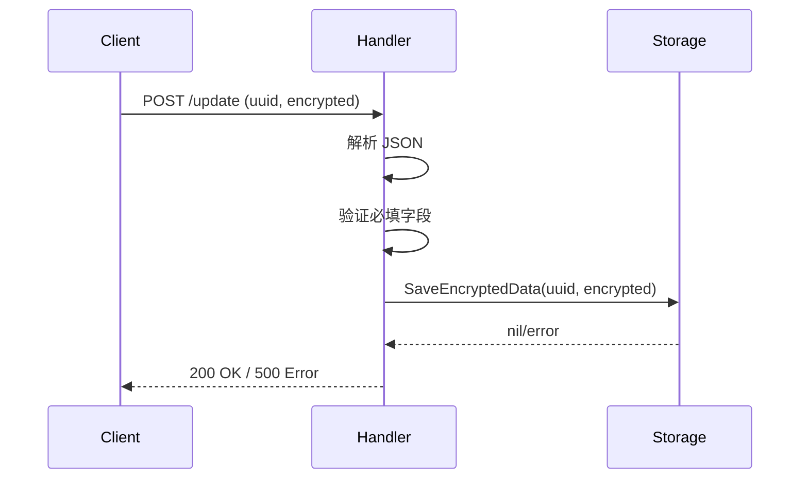
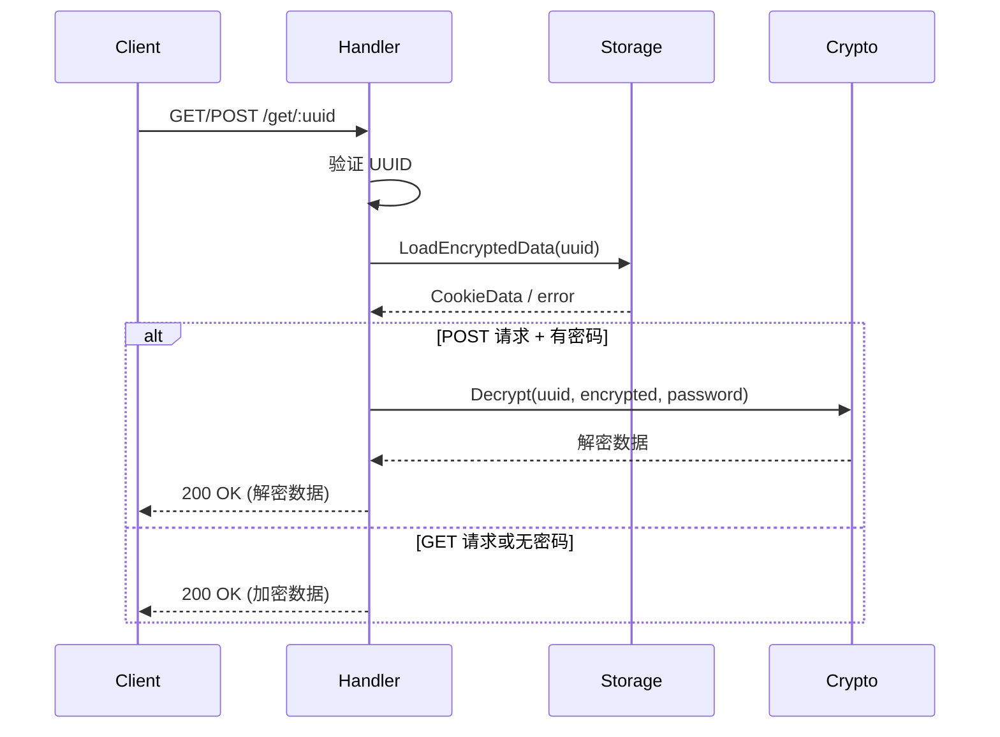

# 请求处理模块 (internal/handlers)

[根目录](../../CLAUDE.md) > [internal](../) > **handlers**

> 最后更新：2026-01-11 16:25:37

## 变更记录

### 2026-01-11 16:25:37
- 初始化模块文档

---

## 这个模块干啥的

这个模块负责处理所有 HTTP 请求，主要干这些事：

1. **解析请求**：解析 JSON 请求体和路径参数
2. **验证参数**：检查必填字段和数据格式
3. **调用业务逻辑**：调用存储层和加密层完成业务
4. **返回响应**：统一构建成功和错误响应
5. **处理错误**：集中处理各类错误并返回友好的错误信息

---

## 对外接口

### API 端点

#### 1. 根路径处理器（看看服务活没活）
```go
func FiberRootHandler(apiRoot string) fiber.Handler
```

**请求**：
```http
GET/POST {API_ROOT}/
```

**响应**：
```http
200 OK
Content-Type: text/plain

Hello World! API ROOT = /api
```

---

#### 2. 更新数据处理器
```go
func FiberUpdateHandler(c *fiber.Ctx) error
```

**请求**：
```http
POST {API_ROOT}/update
Content-Type: application/json

{
  "uuid": "user-device-uuid",
  "encrypted": "base64-encoded-encrypted-data"
}
```

**成功响应**：
```http
200 OK
Content-Type: application/json

{
  "action": "done"
}
```

**错误响应**：
```http
400 Bad Request
{
  "action": "error",
  "reason": "Bad Request: both 'encrypted' and 'uuid' fields are required"
}
```

```http
500 Internal Server Error
{
  "action": "error",
  "reason": "Internal Server Error: failed to save data: ..."
}
```

---

#### 3. 获取数据处理器
```go
func FiberGetHandler(c *fiber.Ctx) error
```

**请求（获取加密数据）**：
```http
GET {API_ROOT}/get/:uuid
```

**响应（加密）**：
```http
200 OK
Content-Type: application/json

{
  "encrypted": "base64-encoded-encrypted-data"
}
```

**请求（解密数据）**：
```http
POST {API_ROOT}/get/:uuid
Content-Type: application/json

{
  "password": "user-password"
}
```

**响应（解密）**：
```http
200 OK
Content-Type: application/json

{ /* 原始 Cookie 数据 */ }
```

**错误响应**：
```http
400 Bad Request
{
  "action": "error",
  "reason": "Bad Request: 'uuid' is required"
}
```

```http
404 Not Found
{
  "action": "error",
  "reason": "Not Found: data not found for uuid"
}
```

---

## 数据模型

### UpdateRequest
更新请求的数据结构

| 字段 | 类型 | 必填 | 说明 |
|-----|------|------|------|
| `uuid` | string | ✅ | 用户设备的唯一标识符 |
| `encrypted` | string | ✅ | Base64 编码的加密数据 |

### DecryptRequest
解密请求的数据结构

| 字段 | 类型 | 必填 | 说明 |
|-----|------|------|------|
| `password` | string | ❌ | 用于解密的密码 |

### CookieData
存储数据结构（来自 storage 包）

| 字段 | 类型 | 说明 |
|-----|------|------|
| `encrypted` | string | 加密的 Cookie 数据 |

---

## 依赖和配置

### 内部依赖
```
internal/handlers
├── internal/crypto    # 加密解密功能
└── internal/storage   # 数据持久化
```

### 外部依赖
```go
import (
    "github.com/gofiber/fiber/v2"  // Web 框架
)
```

### 依赖关系
```go
FiberUpdateHandler
  ↓ 验证参数
  ↓ storage.SaveEncryptedData()
  ↓ 返回成功响应

FiberGetHandler
  ↓ 验证 UUID
  ↓ storage.LoadEncryptedData()
  ↓ 如果是 POST 且有密码
  ↓   crypto.Decrypt()
  ↓ 返回数据（加密或解密）
```

---

## 业务流程

### 更新数据流程


### 获取数据流程


---

## 代码结构

### 文件组织
```
internal/handlers/
└── handlers.go       # 所有 HTTP 处理器
```

### 函数列表

| 函数名 | 参数 | 返回值 | 说明 |
|-------|------|--------|------|
| `FiberRootHandler` | `apiRoot string` | `fiber.Handler` | 返回根路径处理器 |
| `FiberUpdateHandler` | `c *fiber.Ctx` | `error` | 处理更新请求 |
| `FiberGetHandler` | `c *fiber.Ctx` | `error` | 处理获取请求 |
| `sendErrorResponse` | `ctx *fiber.Ctx, statusCode int, reason string` | `error` | 统一错误响应 |

---

## 常见问题

### Q1: 为什么 GET 和 POST 都可以访问根路径？
**A**: 为了兼容性设计。某些客户端可能用 GET 进行健康检查，浏览器插件可能用 POST。

### Q2: 更新数据时会验证数据格式吗？
**A**: 不会。处理器只验证 `uuid` 和 `encrypted` 字段是否存在，不验证加密数据的格式和内容。数据格式验证由加密层负责。

### Q3: 解密失败会返回错误吗？
**A**: 不会返回 HTTP 错误。解密失败时，`crypto.Decrypt()` 返回空的 JSON 对象 `{}`，客户端需要判断返回数据是否为空。

### Q4: 如何支持多个 UUID 的数据管理？
**A**: 当前每个 UUID 对应一个独立的 JSON 文件。要支持批量管理，可以添加新的处理器：
```go
// 示例：列出所有 UUID
app.Get("/list", func(c *fiber.Ctx) error {
    files, _ := os.ReadDir(storage.DataDir)
    var uuids []string
    for _, f := range files {
        uuids = append(uuids, strings.TrimSuffix(f.Name(), ".json"))
    }
    return c.JSON(uuids)
})
```

---

## 错误处理策略

### HTTP 状态码使用

| 状态码 | 场景 | 示例 |
|-------|------|------|
| 200 | 成功 | 数据保存/获取成功 |
| 400 | 客户端错误 | 缺少必填字段、JSON 解析失败 |
| 404 | 资源不存在 | UUID 数据不存在 |
| 500 | 服务器错误 | 文件写入失败、存储层错误 |

### 错误响应格式
```json
{
  "action": "error",
  "reason": "详细的错误原因说明"
}
```

---

## 相关文件清单

### 源代码文件
- `internal/handlers/handlers.go` - 所有 HTTP 处理器

### 依赖模块
- `internal/crypto/crypto.go` - 加密解密功能
- `internal/storage/storage.go` - 数据持久化
- `cmd/cookiecloud/main.go` - 路由注册

---

**模块维护者**：782042369
**最后审核**：2026-01-11
**文档版本**：1.0.0
